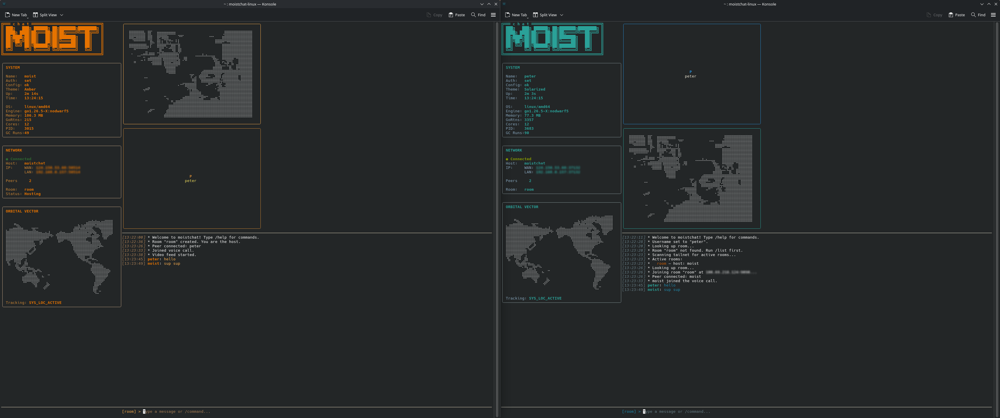

# moistchat — with help from AI

**P2P Terminal Chat with ASCII Video** — a cross-platform peer-to-peer chat, audio call, and ASCII-video app that runs entirely in your terminal over [Tailscale](https://tailscale.com).

<p align="center">
  
</p>

---

## Quick Start

### Prerequisites

- A **Tailscale account** with an [**auth key**](https://login.tailscale.com/admin/settings/authkeys) (ephemeral keys work best).
- **Go 1.26.4** installed (to build from source), or a pre-built binary.

### Build & Run

```bash
git clone https://github.com/Elpoida/moistchat
cd moistchat
```

#### Linux

```bash
# Install Go (if not installed): https://go.dev/dl/go1.26.4.linux-amd64.tar.gz

# Dependencies (audio + camera):
sudo apt install libopus0 libopus-dev pkg-config            # Debian/Ubuntu
sudo dnf install opus opus-devel pkgconf-pkg-config          # Fedora
sudo pacman -S opus pkg-config                               # Arch

# Dev mode (no network, UI only):
make dev

# Run with auth key:
TAILSCALE_AUTH_KEY=tskey-auth-xxxxx make run

# Build binary (auto-detects static libopus.a if available):
make build
./bin/moistchat

# Self-contained build (explicit, fails if static library is missing):
make build-linux
./bin/moistchat
```

> **Distributing a Linux build?** Use `make build-linux`. It statically links
> libopus so the binary has no `libopus.so` runtime dependency. The only
> remaining dynamic dependencies are glibc and ALSA/PulseAudio (which are
> present on virtually every Linux desktop). Verify with
> `ldd bin/moistchat | grep opus` — it should print nothing.

#### macOS

```bash
# Install Go: https://go.dev/dl/go1.26.4.darwin-arm64.pkg (Apple Silicon)
#                        go1.26.4.darwin-amd64.pkg (Intel)

# Install Xcode Command Line Tools (required for audio + camera):
xcode-select --install

# Install Opus codec + pkg-config (build-time dependency):
brew install opus pkg-config

# Dev mode (no network, UI only):
make dev

# Run with auth key:
TAILSCALE_AUTH_KEY=tskey-auth-xxxxx make run

# Build binary (dynamically linked — needs `brew install opus` present to run):
make build
./bin/moistchat

# Self-contained build (libopus statically linked — no runtime dependency):
make build-macos
./bin/moistchat
```

> **macOS builds were contributed by [James Hole](https://github.com/jameshole).**
>
> **Distributing a macOS build?** Use `make build-macos`. It statically links
> libopus so the binary runs on any Mac of the **same architecture** with
> nothing installed (no Homebrew, no `brew install opus`). Confirm it is
> self-contained with `otool -L bin/moistchat | grep -i opus` — it should print
> nothing. Two caveats for the recipient:
>
> - **Architecture-specific.** An `arm64` (Apple Silicon) binary will not run on
>   an Intel Mac and vice-versa. Build on / for the target's architecture.
> - **Unsigned.** macOS Gatekeeper will block it on first launch. The recipient
>   can allow it with `xattr -d com.apple.quarantine moistchat` (or right-click →
>   Open). Signing/notarization requires an Apple Developer ID. And fucked if I'm going to pay $99 so you guys can not get a popup

#### Windows

Build natively in **PowerShell** or **Windows Terminal** with MSYS2/MinGW:

```powershell
# 1. Install Go: https://go.dev/dl/go1.26.4.windows-amd64.msi

# 2. Install MSYS2: https://www.msys2.org/
#    Then in an MSYS2 UCRT64 terminal:
pacman -S mingw-w64-ucrt-x86_64-gcc mingw-w64-ucrt-x86_64-opus

# 3. Build (in PowerShell with CGO enabled):
$env:CGO_ENABLED=1
$env:TAILSCALE_AUTH_KEY="tskey-auth-xxxxx"
go build -ldflags "-X moistchat/internal/network.AuthKey=$env:TAILSCALE_AUTH_KEY" -o moistchat.exe ./cmd/moistchat
.\moistchat.exe
```

#### Production build (any OS)

```bash
# Build with auth key baked into the binary:
TAILSCALE_AUTH_KEY=tskey-auth-xxxxx make build
./bin/moistchat
```

#### Cross-compilation

```bash
make cross-compile
# Output in bin/:
#   moistchat-linux-amd64
#   moistchat-darwin-amd64
#   moistchat-darwin-arm64
#   moistchat-windows-amd64.exe
```

### First-Time Setup

On first launch, moistchat shows:

> Welcome to moistchat! Set your name with /user <name> and your auth key with /auth <key> to get started. Type /help for commands.

1. **Set your name** — `/user Alice`
2. **Set your auth key** — `/auth tskey-auth-xxxxx`
3. **Restart** the app to join your tailnet.

That's it. Your name and auth key are saved in `~/.config/moistchat/config.json` for next time.

---

## Commands

| Command | Example | What it does |
|---------|---------|-------------|
| `/create <room>` | `/create general` | Create a room (you become host) |
| `/join <room>` | `/join general` | Join an existing room |
| `/list` | `/list` | Scan for active rooms on the tailnet |
| `/leave` | `/leave` | Leave the current room |
| `/user <name>` | `/user Bob` | Set your display name |
| `/auth <key>` | `/auth tskey-...` | Save your Tailscale auth key |
| `/call` | `/call` | Start a voice call in the room |
| `/hang` | `/hang` | End the call (stops video too) |
| `/mute` | `/mute` | Toggle microphone mute |
| `/video` | `/video` | Toggle camera broadcast (requires `/call` first) |
| `/contrast <0-100>` | `/contrast 50` | Set video brightness threshold |
| `/settings` | `/settings` | Open settings overlay |
| `/help` | `/help` | Show all commands |
| `/quit` | `/quit` | Exit |

Any line **not** starting with `/` is sent as a chat message to everyone in the room.

---

## Rooms

moistchat uses a **host relay** model: whoever creates the room acts as the server, forwarding messages to everyone else.

- **`/create test`** — You become the host. Others can find and join your room.
- **`/list`** — Discovers rooms via the lobby broker (or network probes as fallback).
- **`/join test`** — Connects to the host. You'll see other peers appear.
- **`/leave`** — Disconnects; if you were the host, remaining peers auto-elect a new host.

### Host Failover

If the host disconnects, surviving peers elect a new one automatically (alphabetically first username wins). The room continues without interruption.

---

## Audio & Video

### Voice Calls (`/call`)

Starts a full-duplex Opus audio call. All peers in the room hear each other. Use `/mute` to toggle your mic, `/hang` to end.

### ASCII Video (`/video`)

Must be in a call first (`/call`). Captures your webcam, converts frames to Braille Unicode art, and broadcasts them to the room. Peers appear as live Braille tiles in the video grid.

- `/contrast 50` — Adjust luminance threshold (0=brighter, 100=darker)
- `/hang` — Stops video + audio

### Device Selection

In `/settings`, you can cycle through available microphones, speakers, and webcams. Selections persist across restarts in `config.json`.

---

## UI Tour

### Left Sidebar (always visible)

| Panel | What it shows |
|-------|--------------|
| **Logo** | ASCII "MOIST ASCII" header |
| **System** | Your username, auth status, theme, uptime, time, OS/arch, Go version, memory, goroutines, CPU cores, PID, GC runs |
| **Network** | Connection status (green dot when connected), hostname, WAN/LAN IP, peer count, room name, host status |
| **Orbital Vector** | Scrolling Braille world map orbiting every 1 second (eye candy) |

### Center Workspace

| Area | What it does |
|------|-------------|
| **Video / Avatars** (top 55%) | Tiled grid of room participants. Self tile shows your camera when `/video` is on. Peer tiles show received video or initial-letter avatars. |
| **Chat Stream** (bottom 45%) | Scrollable message log with colored usernames and timestamps. Auto-scrolls to new messages. |
| **Input Bar** (single line at bottom) | Type messages or `/` commands. Enter to send, Tab for command completion. |

### Settings Panel (`/settings`)

Full-screen overlay. Navigate with `↑`/`↓`, adjust with `←`/`→`, edit with `Enter`. Close with `Esc`.

| Focus | Setting |
|-------|---------|
| 0 | Username (Enter to edit) |
| 1 | Auth key (Enter to edit, masked input) |
| 2 | Input microphone (← → to cycle) |
| 3 | Mic level (← → to adjust 0–100%) |
| 4 | Output speaker (← → to cycle) |
| 5 | Speaker level (← → to adjust 0–100%) |
| 6 | Webcam (← → to cycle) |
| 7 | Contrast (← → to adjust 0–100%) |
| 8 | Theme (← → to cycle 4 themes) |

---

## Themes

Four built-in themes, switch instantly in `/settings` or persist your choice:

| Theme | Vibe |
|-------|------|
| **Solarized** | Light-toned teal/gold |
| **eDEX** (default) | Dark slate with cyan accents |
| **Amber** | Warm amber/gold CRT glow |
| **Neon** | Cool purple/cyan vaporwave |

---

## Keyboard Shortcuts

| Key | Where | Action |
|-----|-------|--------|
| `Tab` | Input bar | Cycle command completion |
| `PgUp` / `PgDn` | Chat | Scroll scrollback by half a page |
| `Home` / `End` | Chat | Jump to oldest / latest message |
| `Mouse wheel` | Chat | Scroll 3 lines at a time |
| `↑` `↓` | Settings | Navigate rows |
| `←` `→` | Settings | Cycle options / adjust sliders |
| `Enter` | Settings (row 0–1) | Inline edit username or auth key |
| `Esc` | Settings | Close settings |
| `Ctrl+C` | Anywhere | Quit |

---

## Configuration

Config lives at `~/.config/moistchat/config.json` (permissions: `0600`):

```json
{
  "username": "Alice",
  "auth_key": "tskey-auth-xxxxx",
  "theme": "eDEX",
  "mic_id": "device-id-string",
  "speaker_id": "device-id-string",
  "webcam_id": "device-id-string"
}
```

Auth key priority: **build-time** (`-ldflags`) > **config file** > **environment variable** (`TAILSCALE_AUTH_KEY`).

Log file: `/tmp/tsnet-moistchat-XXXXXXXXX/moistchat.log`
Tailscale state: ephemeral per session (cleaned up on exit).

---

## Build Targets

### Linux

| Component | Details |
|-----------|---------|
| **Build** | `make build` (auto-detects static libopus) or `make build-linux` (explicit static) |
| **Audio** | ALSA/PulseAudio via malgo (CGO). Requires `libopus-dev` and `pkg-config`. |
| **Camera** | V4L2 via pion/mediadevices |
| **Opus** | Auto-detects `libopus.a`. Falls back to `-lopus` (dynamic) if not found. |
| **Binary** | `bin/moistchat` |

Self-contained static binary (no runtime libopus dependency) when built with
`make build-linux` or when `libopus.a` is present. Verify with
`ldd bin/moistchat | grep opus` — should print nothing.

### macOS

| Component | Details |
|-----------|---------|
| **Build** | `make build` (requires Xcode CLT + Homebrew) |
| **Audio** | CoreAudio via malgo (CGO). Requires Xcode command line tools. |
| **Camera** | AVFoundation via pion/mediadevices (CGO). Requires Xcode command line tools. |
| **Opus** | `brew install opus pkg-config` |
| **Binary** | `bin/moistchat` |

Supports both Apple Silicon (`darwin-arm64`) and Intel (`darwin-amd64`).

### Windows

| Component | Details |
|-----------|---------|
| **Build** | Native MSYS2/MinGW build with `CGO_ENABLED=1` |
| **Audio** | WASAPI via malgo (CGO). Requires MinGW GCC + Opus. |
| **Camera** | DirectShow via pion/mediadevices (CGO) |
| **Opus** | `pacman -S mingw-w64-ucrt-x86_64-gcc mingw-w64-ucrt-x86_64-opus` |
| **Binary** | `moistchat.exe` |

Cross-compilation from Linux/macOS produces a Windows binary, but **audio and camera will not work** — a native Windows build with CGO is required for full features.

### Cross-compilation

```bash
make cross-compile
```

Generates binaries for all platforms in `bin/`:

| File | Platform |
|------|----------|
| `bin/moistchat-linux-amd64` | Linux (AMD64) |
| `bin/moistchat-darwin-amd64` | macOS (Intel) |
| `bin/moistchat-darwin-arm64` | macOS (Apple Silicon) |
| `bin/moistchat-windows-amd64.exe` | Windows (AMD64, CGO disabled — no audio/camera) |

---

## Troubleshooting

**"Connected, but /list shows no rooms"** — Make sure someone has created a room with `/create`. If the lobby broker isn't running (first instance auto-starts it), `/list` falls back to network probes which take a few seconds.

**Video doesn't show** — You need to be in a call first: `/call`, then `/video`. Make sure your webcam is detected (check in `/settings`).

**Audio issues** — Check your mic/speaker selection in `/settings`. On Linux, ensure PulseAudio/ALSA is running. On macOS, install Xcode command line tools. On Windows, use a native MSYS2/MinGW build.

**"No auth key" on startup** — Set one with `/auth` and restart, or pass `TAILSCALE_AUTH_KEY` as an environment variable.

**Clean slate** — `make clean-state` removes Tailscale state. Delete `~/.config/moistchat/config.json` to reset your config.

---

## Credits

- [**James Hole**](https://github.com/jameshole) — macOS build fixes: enabled Opus CGO on `darwin`, added `build-macos` static-linking target, added `nolibopusfile` build tag, and fixed `cross-compile` targets. The resulting macOS binary has zero Homebrew runtime dependencies.
